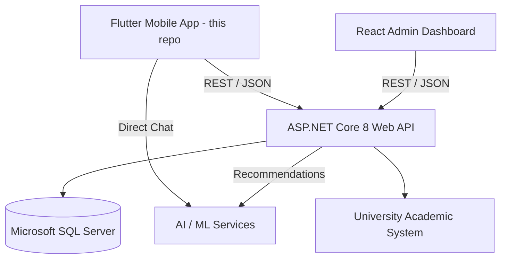
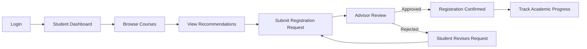
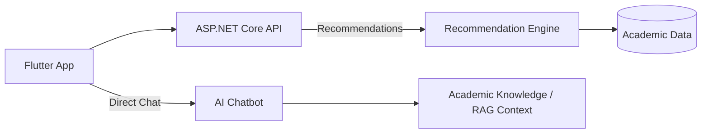

<p align="center">
  
</p>

<h1 align="center">EduAdvisor 🎓</h1>

> **Intelligent Academic Advising and Recommendation Platform**

EduAdvisor is an intelligent academic advising platform that helps university students make better academic decisions, gives advisors a centralized workflow to review registrations and monitor progress, and provides administrators with a unified view of the academic ecosystem.

The platform combines a **Flutter mobile application** (this repository), an **ASP.NET Core backend**, a **React administrative dashboard**, university-system integration, and **AI-powered academic assistance** into one connected ecosystem.

<p align="center">
  <a href="https://flutter.dev"></a>
  <a href="https://dart.dev"></a>
  <a href="https://bloclibrary.dev/"></a>
  <a href="https://docs.flutter.dev/app-architecture/guide"></a>
  <a href="https://flutter.dev/multi-platform"></a>
  <a href="https://pub.dev/packages/get_it"></a>
  <a href="https://pub.dev/packages/go_router"></a>
  <a href="https://github.com/mohamedagm/EduAdvisor/blob/main/LICENSE"></a>
</p>

> 🎓 Graduation project at the **Faculty of Computers and Artificial Intelligence, Fayoum University** (2025/2026)

> **Project Status:** Initial implementation completed and adopted by the university; the platform is under continued development toward real deployment.

---

## 🧠 What is EduAdvisor?

Academic advising becomes difficult to manage as student numbers grow and academic rules become more complex. Students may struggle with course selection, prerequisites, academic planning, and access to timely guidance, while advisors face large workloads and fragmented academic data.

EduAdvisor addresses these challenges by bringing the advising workflow into a centralized platform with a mobile-first experience.

### For Students

- View academic progress, GPA, and degree progress toward graduation.
- Browse the course catalog and inspect course details and prerequisites.
- Receive personalized course recommendations based on academic performance.
- Submit course registration requests for advisor review.
- Track registration request status.
- Get instant academic assistance through the AI chatbot.
- Receive relevant notifications and updates.

### For Advisors

- Monitor assigned students and their academic progress.
- Review course registration requests.
- Approve, reject, or provide decisions on course selections.
- Explore student academic information and performance summaries.
- View advising analytics and performance indicators.

### For Administrators

- Manage students, advisors, roles, and permissions.
- Manage universities, faculties, departments, courses, and semesters.
- Monitor system activities and advising operations.
- Access reports and administrative dashboards.

---

## 🏗️ System Architecture

EduAdvisor is built as a multi-component system. **This repository is the Flutter mobile application**; the backend, dashboard, and AI layer are separate components of the same ecosystem.



### Main Components

| Component              | Technology                 | Responsibility                                     |
| ---------------------- | -------------------------- | -------------------------------------------------- |
| **Mobile Application** | Flutter / Dart             | Student and advisor mobile experiences (this repo) |
| Backend                | ASP.NET Core 8 Web API     | Business logic and API services                    |
| Database               | Microsoft SQL Server       | Academic and application data                      |
| Admin Dashboard        | React.js                   | Administrative management and monitoring           |
| AI Layer               | Python / ML / LLM services | Recommendations and academic chatbot               |
| API Documentation      | Swagger / OpenAPI          | Backend API documentation                          |

---

## 🔄 Core Student Workflow



---

## 📱 Flutter App Architecture

The mobile application follows a **Feature-Based Architecture** combined with **BLoC/Cubit** state management and the **Repository Pattern**.

```text
UI Layer (Presentation)
    ↓
Cubit / BLoC (State Management)
    ↓
Repository (Domain / Data Abstraction)
    ↓
API / Data Services (Dio / Remote Sources)
    ↓
Backend
```

### Typical Feature Flow

1. The user performs an action in the UI.
2. The corresponding Cubit receives the action.
3. The Cubit calls the Repository.
4. The Repository communicates with the API/data service.
5. The result is converted into success or failure states (using the `Either` pattern).
6. The UI reacts to the emitted state.

This structure supports modularity, maintainability, testing, and future feature expansion.

---

## 📚 Main Functional Areas

```text
Authentication (auth)
├── Login
├── Role Selection
├── Student / Advisor Registration
├── Email Verification
├── Forgot / Reset Password
└── Session & Token Refresh

Onboarding
├── Splash Screen
└── Onboarding Screens

Student
├── Dashboard (home)
├── Course Catalog (CourseCatalog)
├── Course Registration (services)
├── Course Recommendations
├── Registration Requests & Status (requests)
├── Academic Profile (profile)
├── AI Chat (AIChat)
└── Notifications

Advisor
├── Advisor Dashboard (advisor_nav)
├── My Students (students)
├── Registration Request Review (requests)
├── Approve / Reject Decisions
└── Analytics (analytics)

Settings
├── Language & Localization
├── Theme / Preferences
├── Notifications
├── Security
└── Logout
```

---

## 📁 High-Level Project Structure

The Flutter application follows a real feature-oriented structure:

```text
lib/
├── core/
│   ├── api/            # Dio client, interceptors, API endpoints
│   ├── di/             # GetIt service locator
│   ├── errors/         # Exceptions & failures (Either pattern)
│   ├── localization/   # Locale management & language preferences
│   ├── routing/        # GoRouter & session navigation
│   ├── services/       # Secure storage, token & user cache
│   ├── theme/          # App colors, text styles, themes
│   ├── utils/
│   └── widgets/
│
├── features/
│   ├── auth/           # Login, registration, verification, password reset
│   ├── onbording/      # Splash and onboarding experience
│   ├── main/           # App shell
│   ├── home/           # Student dashboard
│   ├── CourseCatalog/  # Browse courses, details, prerequisites
│   ├── services/       # Course registration & recommendations
│   ├── requests/       # Registration request workflows & status
│   ├── profile/        # Academic profile, GPA, progress
│   ├── students/       # Advisor: my students
│   ├── analytics/      # Advisor analytics
│   ├── advisor_nav/    # Advisor navigation shell
│   ├── AIChat/         # AI academic assistant
│   ├── user/           # Current user state
│   └── settings/       # Preferences, language, theme
│
├── l10n/               # AR / EN localizations (generated)
├── valdations/         # Form validators
├── main.dart
└── ...
```

---

## 🛠️ Technology Stack

### Mobile Application (this repo)

| Area                 | Technology                                                    |
| -------------------- | ------------------------------------------------------------- |
| Framework            | Flutter / Dart                                                |
| State Management     | flutter_bloc (BLoC / Cubit)                                   |
| Architecture         | Feature-Based + Repository Pattern                            |
| Networking           | Dio (REST APIs, interceptors)                                 |
| Dependency Injection | GetIt                                                         |
| Routing              | GoRouter                                                      |
| Storage              | flutter_secure_storage, shared_preferences                    |
| UI                   | flutter_screenutil, shimmer, cherry_toast                     |
| Localization         | flutter_localizations (AR / EN)                               |
| Error Handling       | dartz (`Either<Failure, ...>`)                                |
| Images               | image_picker                                                  |
| Tools                | flutter_native_splash, flutter_launcher_icons, device_preview |

### Backend Integration

- RESTful APIs
- JWT-based authentication
- Access and refresh token handling
- Role-Based Access Control (RBAC)
- HTTPS / TLS
- API error handling
- Pagination and data mapping

### AI & Machine Learning

- Python
- XGBoost
- scikit-learn
- Qwen2.5-7B-Instruct (via llama-cpp-python)
- FastAPI
- Cloudflare Tunnel



> The AI chatbot is reached **directly** from the mobile app, while course recommendations go through the backend as an intermediary.

---

## 🔐 Security

Because the platform handles academic records and authenticated user accounts, security is a core part of the implementation:

- JWT-based authentication with refresh tokens.
- Role-Based Access Control.
- Secure storage for tokens and session data.
- Input validation across forms.
- Protected role-specific endpoints.

---

## 🗺️ Roadmap

Planned enhancements include:

- Improved machine-learning recommendation models.
- Early academic risk prediction.
- More context-aware chatbot conversations.
- Multi-faculty and multi-university support.
- Offline mobile capabilities.
- Student/advisor feedback loops.
- Real-time notifications and updates.
- Stronger university-system integration.

---

## 👨‍💻 Mobile Team

<p align="center">
<table align="center">
<tr>
<td align="center">
  <a href="https://github.com/mohamedagm">
    <br>
    <b>Mohamed Ahmed</b>
  </a><br>
  <sub>Flutter Developer</sub><br>
  <a href="https://github.com/mohamedagm"></a>
  <a href="https://www.linkedin.com/in/mohamedahmedgm/"></a>
</td>
<td align="center">
  <a href="https://github.com/emanramadan-2">
    <br>
    <b>Eman Ramadan</b>
  </a><br>
  <sub>Flutter Developer</sub><br>
  <a href="https://github.com/emanramadan-2"></a>
  <a href="https://www.linkedin.com/in/eman-ramadan-abdelzaher-owais/"></a>
</td>
</tr>
</table>
</p>

---

<p align="center">Made with 💙 using <a href="https://flutter.dev">Flutter</a></p>
